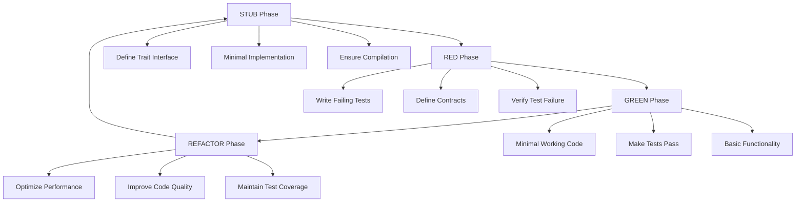
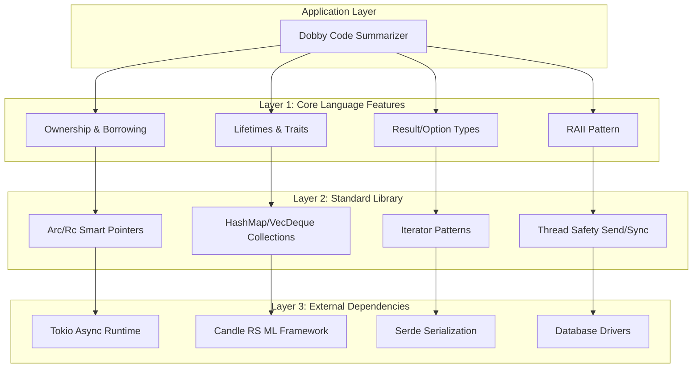
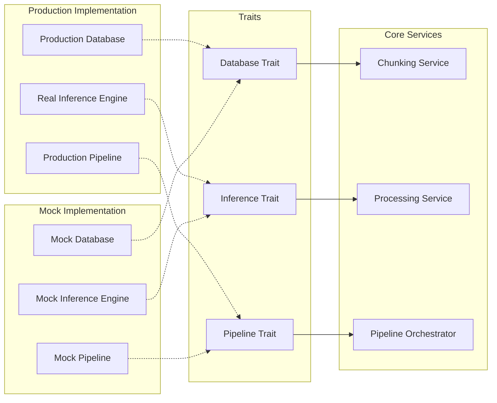
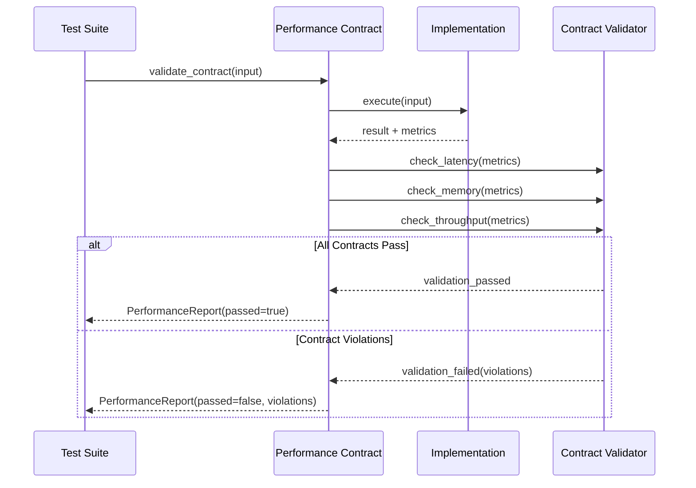
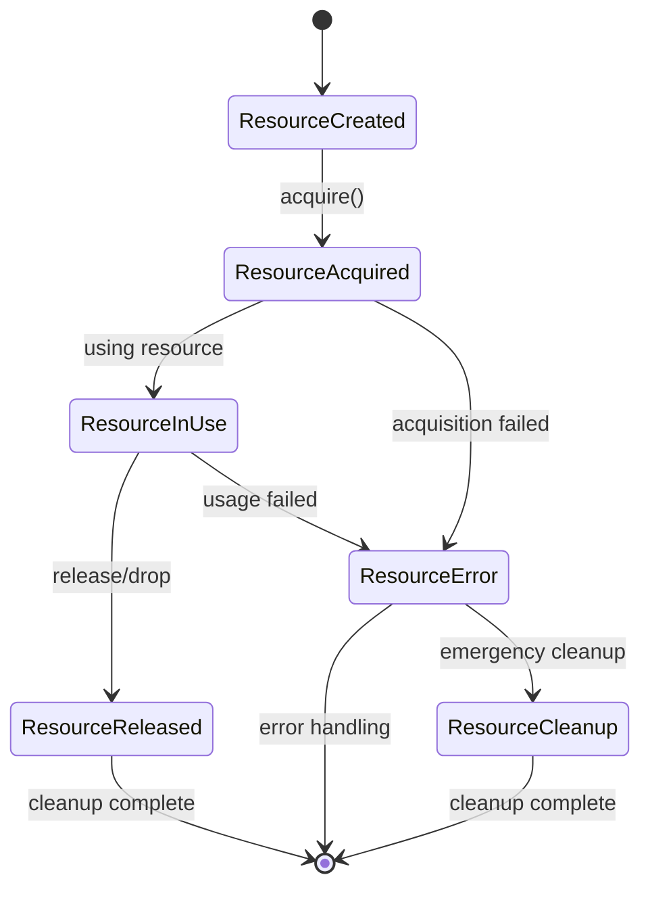
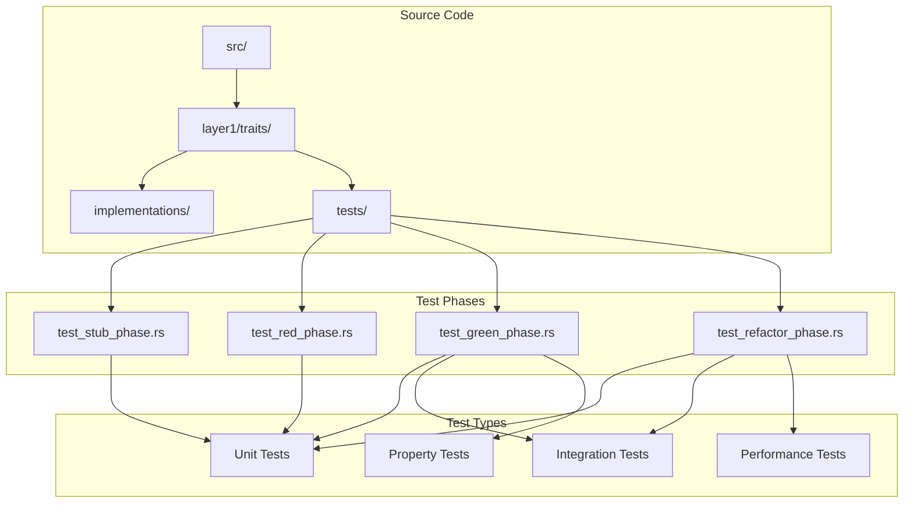
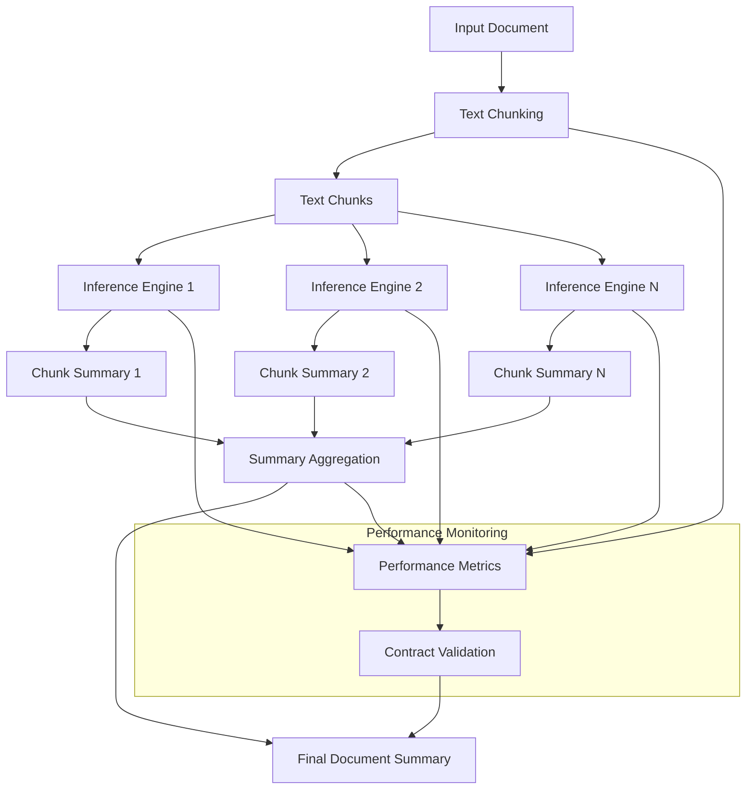
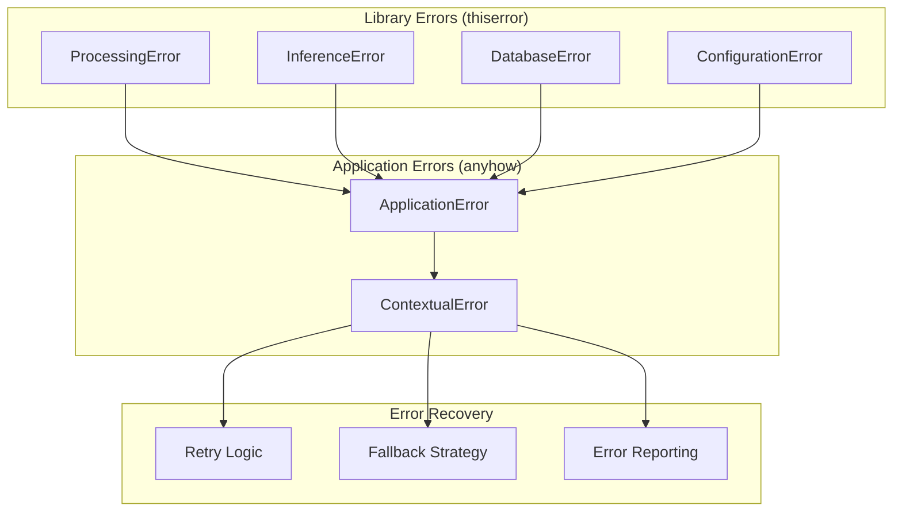
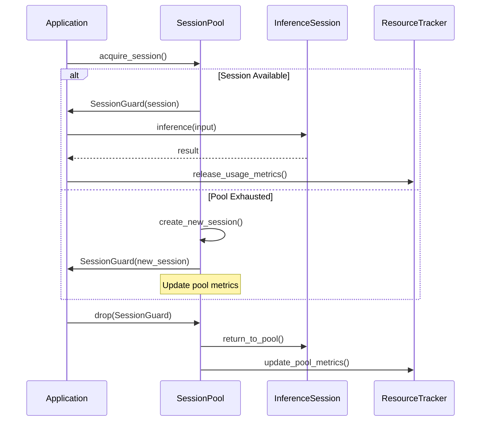
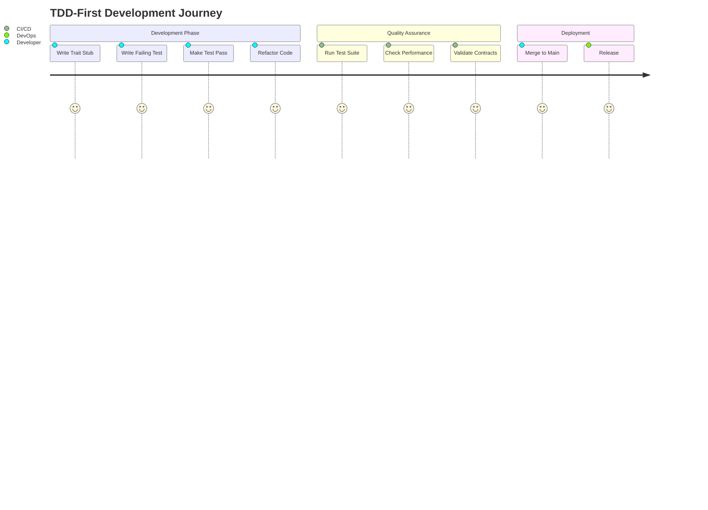

# Mermaid Diagrams for Dobby Project Architecture

## Purpose
This document contains all Mermaid diagrams for the Dobby project, ensuring easy GitHub rendering and architectural visualization.

## 1. TDD-First Development Flow

## 2. Layered Architecture

## 3. Dependency Injection Architecture

## 4. Performance Contract Validation Flow

## 5. RAII Resource Management

## 6. Test Organization Structure

## 7. Pipeline Processing Flow

## 8. Error Handling Hierarchy

## 9. Session Pool Management

## 10. Development Workflow Integration

## Usage Instructions

1. **Copy-paste these diagrams** into GitHub issues, PRs, or README files
2. **Mermaid automatically renders** in GitHub's markdown viewer
3. **Update diagrams** when architecture changes
4. **Keep this as single source of truth** for all architectural diagrams

These diagrams provide clear visualization of the TDD-First architecture and development workflow for the Dobby project.