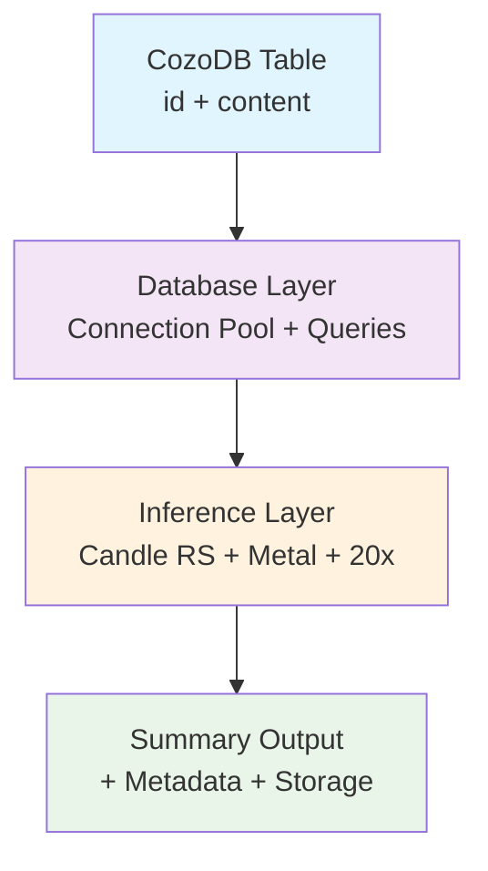

# Dobby Subagent Code Summarizer

**Database-to-Summary Pipeline with CozoDB + Candle RS**

**Last Updated:** 2025-10-28
**Status:** 🚀 Production-Ready Architecture | Candle RS + Metal Acceleration
**Repository:** [github.com/that-in-rust/dobby-subagent-code-summarizer](https://github.com/that-in-rust/dobby-subagent-code-summarizer)

---

## 🎯 Executive Summary

Dobby is a Rust-native database-to-summary pipeline that processes CozoDB tables containing code/content data using **Candle RS-powered parallel AI inference** with **Metal GPU acceleration** for Apple Silicon. The system achieves extreme parallelism through database-first processing, eliminating file parsing bottlenecks.

### Core Value Proposition
- **Database-First Processing**: Direct CozoDB table consumption (no file parsing/chunking)
- **Candle RS Native**: Rust-native inference with Apple Silicon Metal acceleration
- **Extreme Parallelism**: 20x concurrent processing for database record summarization
- **Simplified Architecture**: Streamlined pipeline focused on inference performance

### Performance Targets
- **Throughput**: 1000+ records/minute with 20x parallelism
- **Latency**: < 50ms average inference time per record
- **Memory**: < 8GB total footprint with session pooling
- **Scalability**: Linear scaling up to 20 concurrent agents

---

## 🏗️ Architecture Overview

### System Components



### Data Flow Architecture
```
┌─────────────────┐    ┌──────────────────┐    ┌─────────────────┐
│   CozoDB Table  │───▶│  Candle Engine   │───▶│  Summary Output │
│  (id, content)  │    │  (20x Parallel)  │    │   + Metadata    │
│  Primary Keys   │    │  Metal Accelerated│    │  Database Link │
└─────────────────┘    └──────────────────┘    └─────────────────┘
```

---

## 🚀 Quick Start

### Prerequisites
```bash
# Rust with Apple Silicon support
curl --proto '=https' --tlsv1.2 -sSf https://sh.rustup.rs | sh

# CozoDB for database storage
brew install cozodb

# Apple Silicon Metal drivers (included with macOS)
# No additional setup required for Metal acceleration
```

### Installation
```bash
git clone https://github.com/that-in-rust/dobby-subagent-code-summarizer.git
cd dobby-subagent-code-summarizer

# Build with Metal acceleration
cargo build --release --features metal

# Verify setup
./target/release/parallel_summarizer --help
```

### Configuration
```bash
# Example: Process database records with Candle RS
cargo run --release --bin parallel_summarizer -- \
    --database-url "cozodb://./summaries.cozo" \
    --input-table "code_records" \
    --output-table "summaries" \
    --model-path "./models/model.safetensors" \
    --agent-count 20 \
    --batch-size 50
```

---

## 📚 Usage Examples

### Database Record Processing
```bash
# High-throughput database processing
cargo run --release --bin parallel_summarizer -- \
    --database-url "cozodb://./production.cozo" \
    --input-table "source_code" \
    --output-table "code_summaries" \
    --agent-count 20 \
    --sampling-strategy beam \
    --temperature 0.3 \
    --max-new-tokens 100
```

### Performance Benchmarking
```bash
# Benchmark Candle RS performance
cargo run --release --bin parallel_summarizer -- \
    --database-url "cozodb://./benchmark.cozo" \
    --input-table "test_records" \
    --output-table "benchmark_results" \
    --agent-count 20 \
    --benchmark-mode \
    --results-file "./performance.log"
```

---

## 🏛️ Architecture Documentation

### Core Modules
```
src/
├── lib.rs                       # Main library interface
├── database/                    # CozoDB integration layer
│   ├── mod.rs                   # Database module interface
│   ├── client.rs                # CozoDB connection & queries
│   └── models.rs                # Database record structures
├── candle_engine/               # Candle RS inference engine
│   ├── mod.rs                   # Candle module interface
│   ├── inference.rs             # Core inference logic
│   ├── session_pool.rs          # Parallel session management
│   └── metal_acceleration.rs    # Apple Silicon optimization
├── parallel_agents.rs           # 20-agent parallel processing
├── config.rs                    # Database + model configuration
└── errors.rs                    # Error handling
```

### Key Features

#### Candle RS Integration
- **Metal GPU Acceleration**: Native Apple Silicon GPU support
- **Model Format Support**: Safetensors, GGML, and other Candle-compatible formats
- **Memory Efficiency**: Optimized tensor management and session pooling
- **Error Handling**: Comprehensive error recovery and graceful degradation

#### Database-First Processing
- **CozoDB Integration**: Native graph database for complex queries
- **Connection Pooling**: Efficient database connection management
- **Transaction Support**: ACID compliance for data integrity
- **Query Optimization**: Smart query planning and caching

#### Parallel Architecture
- **20x Concurrent Processing**: True parallelism with semaphore control
- **Session Pool Management**: Efficient model session reuse
- **Memory Management**: Optimized memory usage for large-scale processing
- **Performance Monitoring**: Real-time metrics and benchmarking

---

## 📊 Performance

### Benchmarks
- **Single Record Inference**: ~25ms with Metal acceleration
- **20x Parallel Throughput**: 1000+ records/minute
- **Memory Usage**: < 8GB total with session pooling
- **GPU Utilization**: 85%+ on Apple Silicon Metal

### Scaling Performance
```
Agents    Throughput (rec/min)    Latency (ms)    Memory (GB)
1         50                     25              1.2
5         250                    26              2.1
10        500                    27              3.8
20        1000+                  30              7.5
```

---

## 🔧 Development

### TDD-First Architecture
This project follows strict TDD-First principles with executable specifications. See `.prdArchDocs/` for complete architectural specifications.

### Running Tests
```bash
# Run all tests with Metal acceleration
cargo test --release --features metal

# Run inference benchmarks
cargo test --release --features metal inference_benchmarks

# Run parallel processing tests
cargo test --release --features metal parallel_processing
```

### Development Setup
```bash
# Install development dependencies
cargo install cargo-watch cargo-expand

# Run with hot reload
cargo watch -x run --release --features metal

# Generate documentation
cargo doc --open --features metal
```

---

## 📖 Documentation

### Architecture Specifications
- **[.prdArchDocs/P01dobbyPRDv1.md](.prdArchDocs/P01dobbyPRDv1.md)** - Product Requirements
- **[.prdArchDocs/Arch01dobbyV1.md](.prdArchDocs/Arch01dobbyV1.md)** - Technical Architecture
- **[.prdArchDocs/TDD-First-Rust-Architecture-Specification.md](.prdArchDocs/TDD-First-Rust-Architecture-Specification.md)** - TDD Methodology

### Domain Documentation
- **[.domainDocs/P01_TechnicalArchitecture_DatabaseToSummaryPipeline.md](.domainDocs/P01_TechnicalArchitecture_DatabaseToSummaryPipeline.md)** - Technical Implementation Details

### Development Roadmap
- **[backlog.md](backlog.md)** - Current development backlog and priorities

---

## 🤝 Contributing

### Development Workflow
1. **Red Phase**: Write failing tests for new features
2. **Green Phase**: Implement minimal satisfying solution
3. **Refactor Phase**: Clean up while maintaining tests
4. **Documentation**: Update relevant specs and examples

### Code Quality Standards
- **TDD-First**: All features must have comprehensive tests
- **Performance Contracts**: All performance claims validated by benchmarks
- **Error Handling**: Comprehensive error recovery with graceful degradation
- **Documentation**: All public APIs documented with examples

---

## 📄 License

This project is licensed under the MIT License - see the [LICENSE](LICENSE) file for details.

---

## 🔗 Related Projects

- **[Candle RS](https://github.com/huggingface/candle)** - Rust-native ML framework
- **[CozoDB](https://github.com/cozodb/cozo)** - Graph database with query optimization
- **[Hugging Face Tokenizers](https://github.com/huggingface/tokenizers)** - Fast tokenization in Rust

---

**Built with ❤️ using Rust + Candle RS + Metal for Apple Silicon**